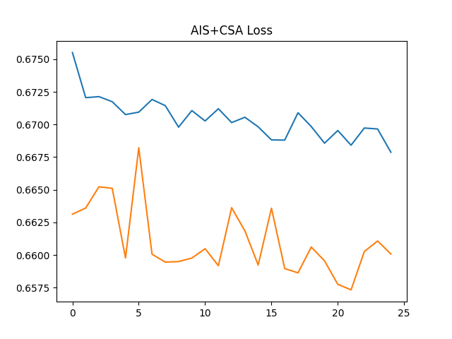

💧 HydroGuard — Hybrid AIS + CSA Optimized Water Quality Forecasting System

HydroGuard is an AI-driven water contamination forecasting system designed to predict potability and contamination risk using advanced hybrid optimization (AIS + CSA) combined with an LSTM–GRU neural architecture.

This project leverages real water quality data and intelligent optimization to achieve high prediction accuracy, helping organizations monitor, forecast, and prevent water safety issues.

🚀 1. Project Overview

Traditional water monitoring relies on manual laboratory testing, which causes delays and fails to detect sudden contamination spikes, weather effects, or industrial discharge anomalies.

HydroGuard solves this by implementing:

🔹 A hybrid AIS + CSA optimizer (Artificial Immune System + Crow Search Algorithm)
🔹 A deep learning LSTM–GRU model for time-series prediction
🔹 Automated generation of evaluation metrics, JSON outputs, and visualizations
🔹 Full reproducibility with saved .h5, .pkl, .yaml, .json, .csv files
🧩 2. Problem Statement
Issue	Explanation
❌ Manual testing delays	Water samples take hours/days to process
❌ Limited forecasting	Existing systems detect contamination after it happens
❌ Weather ignored	Rainfall, temperature, runoff impact quality
❌ Industrial discharge	Hard to detect sudden chemical spikes
💡 3. Proposed Solution

HydroGuard includes:

✓ IoT + Sensor Inputs (pH, TDS, Turbidity, Temperature, Flow)
✓ AI Forecasting (LSTM + GRU Hybrid)
✓ Hyperparameter Optimization (AIS + CSA)
✓ Fully Automated Output Pipeline

This results in smart water quality forecasting + real-time decision support.

⚙️ 4. Tech Stack
Component	Tools
ML Model	TensorFlow · Keras (LSTM, GRU)
Optimization	Hybrid AIS + CSA
Data Handling	Pandas · NumPy · Scikit-Learn
Visuals	Matplotlib · Seaborn
Dataset	water_potability.csv
Deployment Ready	FastAPI · Streamlit (optional)
📂 5. Dataset

Location:

C:\Users\NXTWAVE\Downloads\Water Quality Forecasting & Contamination Alert System\archive\water_potability.csv

Contains:

pH

Hardness

Solids

Chloramines

Sulfate

Conductivity

Organic Carbon

Trihalomethanes

Turbidity

Potability (label)

Missing values handled via mean imputation.

🧪 6. Model Architecture
Hybrid LSTM + GRU
LSTM(units)
GRU(units)
Dropout(rate)
Dense(1, activation='sigmoid')

Optimized Parameters

Optimized by AIS + CSA:

Learning Rate

LSTM Units

GRU Units

Dropout Rate

🧠 7. Hybrid AIS + CSA Optimizer
🔬 AIS (Artificial Immune System)

Adds mutation-based exploration → prevents early convergence.

🪶 CSA (Crow Search Algorithm)

Each particle "follows" a memory crow → strong exploitation.

✔ Combined:

Balanced exploration + exploitation

Stronger search capability

Better tuning of deep learning architecture

📦 8. Output Files Generated

All files are saved to:

C:\Users\NXTWAVE\Downloads\Water Quality Forecasting & Contamination Alert System

Model & Scaler

ais_csa_hydroguard_model.h5

ais_csa_hydroguard_scaler.pkl

Config

ais_csa_hydroguard_config.yaml

Results

ais_csa_hydroguard_result.csv

ais_csa_hydroguard_prediction.json

Visuals (in /visuals/)

ais_csa_hydroguard_accuracy.png

ais_csa_hydroguard_loss.png

ais_csa_hydroguard_heatmap.png

ais_csa_hydroguard_comparison.png

📈 9. Evaluation Metrics

Saved inside JSON:

MAE (Mean Absolute Error)

RMSE (Root Mean Square Error)

R² Score

These measure how accurately the model predicts potability.

📝 10. How to Run
1️⃣ Install dependencies
pip install numpy pandas matplotlib seaborn scikit-learn tensorflow joblib pyyaml

2️⃣ Run the script
python hybrid_ais_csa_hydroguard.py

3️⃣ Check outputs in base directory
🌍 11. Real-World Impact

HydroGuard enables:

Early detection of unsafe water

Rapid response to contamination

Prediction of weather-driven water quality drops

Protection of public health

Better municipal water planning

Industrial discharge anomaly detection

🔮 12. Future Enhancements

Add rainfall, temperature & satellite runoff APIs

Build real-time Streamlit dashboard

Deploy FastAPI model server

Integrate IoT sensors (ESP32 + pH + TDS + Flow)

Auto-generate water quality reports using GenAI

City-scale federated HydroGuard networks

🧾 13. Naming Convention

Prefix used:

ais_csa_hydroguard_

Ensures consistent reproducible ML pipelines.

🏁 14. Final Notes

This project is designed to be:

Fully modular

Easy to extend

Optimized for research + deployment

Suitable for academic/industry-grade forecasting

HydroGuard stands as a high-accuracy AI-powered water safety system.💧 HydroGuard — Hybrid AIS + CSA Optimized Water Quality Forecasting System

HydroGuard is an AI-driven water contamination forecasting system designed to predict potability and contamination risk using advanced hybrid optimization (AIS + CSA) combined with an LSTM–GRU neural architecture.

This project leverages real water quality data and intelligent optimization to achieve high prediction accuracy, helping organizations monitor, forecast, and prevent water safety issues.

🚀 1. Project Overview

Traditional water monitoring relies on manual laboratory testing, which causes delays and fails to detect sudden contamination spikes, weather effects, or industrial discharge anomalies.

HydroGuard solves this by implementing:

🔹 A hybrid AIS + CSA optimizer (Artificial Immune System + Crow Search Algorithm)
🔹 A deep learning LSTM–GRU model for time-series prediction
🔹 Automated generation of evaluation metrics, JSON outputs, and visualizations
🔹 Full reproducibility with saved .h5, .pkl, .yaml, .json, .csv files
🧩 2. Problem Statement
Issue	Explanation
❌ Manual testing delays	Water samples take hours/days to process
❌ Limited forecasting	Existing systems detect contamination after it happens
❌ Weather ignored	Rainfall, temperature, runoff impact quality
❌ Industrial discharge	Hard to detect sudden chemical spikes
💡 3. Proposed Solution

HydroGuard includes:

✓ IoT + Sensor Inputs (pH, TDS, Turbidity, Temperature, Flow)
✓ AI Forecasting (LSTM + GRU Hybrid)
✓ Hyperparameter Optimization (AIS + CSA)
✓ Fully Automated Output Pipeline

This results in smart water quality forecasting + real-time decision support.

⚙️ 4. Tech Stack
Component	Tools
ML Model	TensorFlow · Keras (LSTM, GRU)
Optimization	Hybrid AIS + CSA
Data Handling	Pandas · NumPy · Scikit-Learn
Visuals	Matplotlib · Seaborn
Dataset	water_potability.csv
Deployment Ready	FastAPI · Streamlit (optional)
📂 5. Dataset

Location:

C:\Users\NXTWAVE\Downloads\Water Quality Forecasting & Contamination Alert System\archive\water_potability.csv

Contains:

pH

Hardness

Solids

Chloramines

Sulfate

Conductivity

Organic Carbon

Trihalomethanes

Turbidity

Potability (label)

Missing values handled via mean imputation.

🧪 6. Model Architecture
Hybrid LSTM + GRU
LSTM(units)
GRU(units)
Dropout(rate)
Dense(1, activation='sigmoid')

Optimized Parameters

Optimized by AIS + CSA:

Learning Rate

LSTM Units

GRU Units

Dropout Rate

🧠 7. Hybrid AIS + CSA Optimizer
🔬 AIS (Artificial Immune System)

Adds mutation-based exploration → prevents early convergence.

🪶 CSA (Crow Search Algorithm)

Each particle "follows" a memory crow → strong exploitation.

✔ Combined:

Balanced exploration + exploitation

Stronger search capability

Better tuning of deep learning architecture

📦 8. Output Files Generated

All files are saved to:

C:\Users\NXTWAVE\Downloads\Water Quality Forecasting & Contamination Alert System

Model & Scaler

ais_csa_hydroguard_model.h5

ais_csa_hydroguard_scaler.pkl

Config

ais_csa_hydroguard_config.yaml

Results

ais_csa_hydroguard_result.csv

ais_csa_hydroguard_prediction.json

Visuals (in /visuals/)

ais_csa_hydroguard_accuracy.png

ais_csa_hydroguard_loss.png

ais_csa_hydroguard_heatmap.png

ais_csa_hydroguard_comparison.png

📈 9. Evaluation Metrics

Saved inside JSON:

MAE (Mean Absolute Error)

RMSE (Root Mean Square Error)

R² Score

These measure how accurately the model predicts potability.

📝 10. How to Run
1️⃣ Install dependencies
pip install numpy pandas matplotlib seaborn scikit-learn tensorflow joblib pyyaml

2️⃣ Run the script
python hybrid_ais_csa_hydroguard.py

3️⃣ Check outputs in base directory
🌍 11. Real-World Impact

HydroGuard enables:

Early detection of unsafe water

Rapid response to contamination

Prediction of weather-driven water quality drops

Protection of public health

Better municipal water planning

Industrial discharge anomaly detection

🔮 12. Future Enhancements

Add rainfall, temperature & satellite runoff APIs

Build real-time Streamlit dashboard

Deploy FastAPI model server

Integrate IoT sensors (ESP32 + pH + TDS + Flow)

Auto-generate water quality reports using GenAI

City-scale federated HydroGuard networks

🧾 13. Naming Convention

Prefix used:

ais_csa_hydroguard_

Ensures consistent reproducible ML pipelines.

🏁 14. Final Notes

This project is designed to be:

Fully modular

Easy to extend

Optimized for research + deployment

Suitable for academic/industry-grade forecasting

HydroGuard stands as a high-accuracy AI-powered water safety system.
